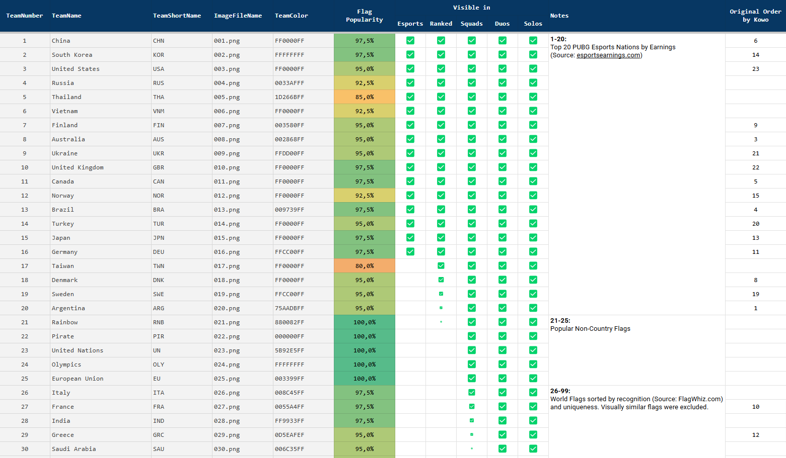

# PUBG FlagFeed by n1tn4t

100+ PUBG Killfeed Flag Icons for Squads, Duos and Solos.\
Original Idea by [Kowo](https://youtu.be/8OWbQ_wXhpk?si=w6JcehJ6YkvV1RMY)

## Flag List

[See the full list (Google Sheets)](https://docs.google.com/spreadsheets/d/e/2PACX-1vS-DgA-r6pEoqVMCBzSthSo4WQjUdB8NNeRpbzHDSD4csEhjYtBUS2wuhFXPchpVrOgrKznMFfwhZ6t/pubhtml)

## Install

1. Download the latest release on Github
2. Open Windows Explorer and paste `%LOCALAPPDATA%\TslGame\Saved` into the address bar at the top, then press Enter.
3. Paste the `Observer` folder there (the `Observer` folder should contain the `TeamIcon` folder, the `TeamIcon Numbered` folder and the `Teaminfo.csv` file)
4. **Optional**: If you want to use the Numbered Icons, rename the folder from `TeamIcon Numbered` to `TeamIcon`. You can rename the other folder to anything you want.
5. Enjoy your Chicken Dinners! 🍗🎉

## Make my day

If you like my work and want to support it, you can buy me a coffee (or two).\
Every donation helps me keep things going. Thank you! 💙

[**Donate via PayPal**](https://www.paypal.com/donate/?hosted_button_id=X49DU3LMCLMPJ)
