# PUBG FlagFeed by n1tn4t

### 100+ PUBG Killfeed Flag Icons for Squads, Duos and Solos.

Original Idea by [Kowo](https://youtu.be/8OWbQ_wXhpk?si=w6JcehJ6YkvV1RMY)

## Flag List

| #1                                                            | #2                                                                    | TeamNumber    | TeamName                  | TeamShortName | ImageFileName     | TeamColor |
|---------------------------------------------------------------|-----------------------------------------------------------------------|---------------|---------------------------|---------------|-------------------|-----------|
|   |   | 1             | China                     | CHN           | 001.png           | FF0000FF  |
|   |   | 2             | South Korea               | KOR           | 002.png           | FFFFFFFF  |
| 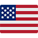  |   | 3             | United States             | USA           | 003.png           | FF0000FF  |
|   |   | 4             | Russia                    | RUS           | 004.png           | 0033AFFF  |
|   |   | 5             | Thailand                  | THA           | 005.png           | 1D266BFF  |
|   |   | 6             | Vietnam                   | VNM           | 006.png           | FF0000FF  |
|   |   | 7             | Finland                   | FIN           | 007.png           | 003580FF  |
| 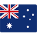  |   | 8             | Australia                 | AUS           | 008.png           | 002868FF  |
|   |   | 9             | Ukraine                   | UKR           | 009.png           | FFDD00FF  |
|   |   | 10            | United Kingdom            | GBR           | 010.png           | FF0000FF  |
|   |   | 11            | Canada                    | CAN           | 011.png           | FF0000FF  |
|   |   | 12            | Norway                    | NOR           | 012.png           | FF0000FF  |
|   |   | 13            | Brazil                    | BRA           | 013.png           | 009739FF  |
|   |   | 14            | Turkey                    | TUR           | 014.png           | FF0000FF  |
|   | 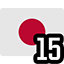  | 15            | Japan                     | JPN           | 015.png           | FF0000FF  |
|   |   | 16            | Germany                   | DEU           | 016.png           | FFCC00FF  |
|   |   | 17            | Taiwan                    | TWN           | 017.png           | FF0000FF  |
|   |   | 18            | Denmark                   | DNK           | 018.png           | FF0000FF  |
|   |   | 19            | Sweden                    | SWE           | 019.png           | FFCC00FF  |
|   |   | 20            | Argentina                 | ARG           | 020.png           | 75AADBFF  |
|   |   | 21            | Rainbow                   | RNB           | 021.png           | 880082FF  |
|   |   | 22            | Pirate                    | PIR           | 022.png           | 000000FF  |
|   |   | 23            | United Nations            | UN            | 023.png           | 5B92E5FF  |
| 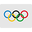  |   | 24            | Olympics                  | OLY           | 024.png           | FFFFFFFF  |
|   |   | 25            | European Union            | EU            | 025.png           | 003399FF  |
|   |   | 26            | Italy                     | ITA           | 026.png           | 008C45FF  |
|   |   | 27            | France                    | FRA           | 027.png           | 0055A4FF  |
|   |   | 28            | India                     | IND           | 028.png           | FF9933FF  |
|   |   | 29            | Greece                    | GRC           | 029.png           | 0D5EAFEF  |
|   |   | 30            | Saudi Arabia              | SAU           | 030.png           | 006C35FF  |
| 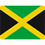  |   | 31            | Jamaica                   | JAM           | 031.png           | FFD700FF  |
|   |   | 32            | Spain                     | ESP           | 032.png           | AA151BFF  |
|   |   | 33            | Switzerland               | CHE           | 033.png           | FF0000FF  |
| 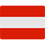  |   | 34            | Mexico                    | MEX           | 034.png           | 006341FF  |
|   |   | 35            | Belgium                   | BEL           | 035.png           | FFD700FF  |
|   |   | 36            | Ireland                   | IRL           | 036.png           | FF883EFF  |
|   |   | 37            | Israel                    | ISR           | 037.png           | 0038B8FF  |
|   |   | 38            | Poland                    | POL           | 038.png           | FF0000FF  |
| 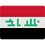  |   | 39            | Iraq                      | IRQ           | 039.png           | FF0000FF  |
|   |   | 40            | South Africa              | ZAF           | 040.png           | 007847FF  |
| 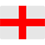  |   | 41            | England                   | ENG           | 041.png           | FF0000FF  |
|   |   | 42            | Scotland                  | SCO           | 042.png           | 0065BDFF  |
|   |   | 43            | Wales                     | WAL           | 043.png           | D30000FF  |
|   |   | 44            | Pakistan                  | PAK           | 044.png           | 115740FF  |
|   |   | 45            | Netherlands               | NLD           | 045.png           | FF0000FF  |
|   |   | 46            | Portugal                  | PRT           | 046.png           | 006600FF  |
|   |   | 47            | Iceland                   | ISL           | 047.png           | 02529CFF  |
| 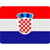  |   | 48            | Croatia                   | HRV           | 048.png           | FF0000FF  |
|   |   | 49            | Chile                     | CHL           | 049.png           | FF0000FF  |
|   |   | 50            | Qatar                     | QAT           | 050.png           | 8A1538FF  |
|   |   | 51            | Nepal                     | NPL           | 051.png           | DC143CFF  |
|   |   | 52            | Albania                   | ALB           | 052.png           | FF0000FF  |
|   | 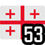  | 53            | Georgia                   | GEO           | 053.png           | FF0000FF  |
|   |   | 54            | Iran                      | IRN           | 054.png           | 239F40FF  |
|   |   | 55            | Morocco                   | MAR           | 055.png           | FF0000FF  |
|   |   | 56            | Kenya                     | KEN           | 056.png           | 006600FF  |
|   |   | 57            | Colombia                  | COL           | 057.png           | FCD116FF  |
|   |   | 58            | Cuba                      | CUB           | 058.png           | FF0000FF  |
|   |   | 59            | Czech Republic            | CZE           | 059.png           | 11457EFF  |
|   |   | 60            | Afghanistan               | AFG           | 060.png           | 007A36FF  |
|   |   | 61            | Austria                   | AUT           | 061.png           | FF0000FF  |
|   |   | 62            | North Korea               | PRK           | 062.png           | FF0000FF  |
|   |   | 63            | Cyprus                    | CYP           | 063.png           | D6861EFF  |
|   |   | 64            | Sri Lanka                 | LKA           | 064.png           | FF9933FF  |
|   |   | 65            | Uruguay                   | URY           | 065.png           | 0038A8FF  |
|   |   | 66            | Bangladesh                | BGD           | 066.png           | 006A4EFF  |
|   |   | 67            | Kazakhstan                | KAZ           | 067.png           | 0099CCFF  |
|   |   | 68            | Venezuela                 | VEN           | 068.png           | FFC72CFF  |
|   |   | 69            | Slovakia                  | SVK           | 069.png           | FF0000FF  |
|   |   | 70            | Bosnia and Herzegovina    | BIH           | 070.png           | 002F6CFF  |
|   |   | 71            | Panama                    | PAN           | 071.png           | FF0000FF  |
|   |   | 72            | Estonia                   | EST           | 072.png           | 0072B6FF  |
|   |   | 73            | Cambodia                  | KHM           | 073.png           | 002F6CFF  |
|   |   | 74            | Jordan                    | JOR           | 074.png           | FF0000FF  |
|   |   | 75            | Nigeria                   | NGA           | 075.png           | 008753FF  |
|   |   | 76            | Ghana                     | GHA           | 076.png           | FFD700FF  |
|   |   | 77            | Tunisia                   | TUN           | 077.png           | FF0000FF  |
|   |   | 78            | Dominican Republic        | DOM           | 078.png           | FF0000FF  |
|   |   | 79            | Barbados                  | BRB           | 079.png           | FFC72CFF  |
|   | 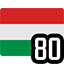  | 80            | Hungary                   | HUN           | 080.png           | 008000FF  |
|   |   | 81            | Azerbaijan                | AZE           | 081.png           | 00BFFFFF  |
|   |   | 82            | Serbia                    | SRB           | 082.png           | FF0000FF  |
|   |   | 83            | North Macedonia           | MKD           | 083.png           | FFB700FF  |
|   |   | 84            | United Arab Emirates      | ARE           | 084.png           | 00732CFF  |
|   |   | 85            | Seychelles                | SYC           | 085.png           | 0033AFFF  |
|   |   | 86            | Algeria                   | DZA           | 086.png           | 006233FF  |
|   |   | 87            | Cameroon                  | CMR           | 087.png           | 007A5EFF  |
|   |   | 88            | Kosovo                    | XKX           | 088.png           | 002F6CFF  |
|   |   | 89            | Peru                      | PER           | 089.png           | FF0000FF  |
|   |   | 90            | Costa Rica                | CRI           | 090.png           | FF0000FF  |
|   |   | 91            | San Marino                | SMR           | 091.png           | 5B92E5FF  |
|   |   | 92            | Trinidad and Tobago       | TTO           | 092.png           | FF0000FF  |
|   |   | 93            | Marshall Islands          | MHL           | 093.png           | 002B7FFF  |
|   |   | 94            | Somalia                   | SOM           | 094.png           | 4189DDFF  |
|   | 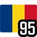  | 95            | Romania                   | ROU           | 095.png           | 002B7FFF  |
|   |   | 96            | Mongolia                  | MNG           | 096.png           | FF0000FF  |
|   |   | 97            | Malta                     | MLT           | 097.png           | FFFFFFFF  |
|   |   | 98            | Angola                    | AGO           | 098.png           | FF0000FF  |
|   |   | 99            | Liechtenstein             | LIE           | 099.png           | 002F6CFF  |
|   |   | 100           | Uganda                    | UGA           | 100.png           | FFD700FF  |
|   |   | 101           | Belarus                   | BLR           | 101.png           | FF0000FF  |
|   |   | 102           | Sudan                     | SDN           | 102.png           | FF0000FF  |
|   |   | 103           | Armenia                   | ARM           | 103.png           | D90012FF  |
|   |   | 104           | Saint Lucia               | LCA           | 104.png           | 66CCFFFF  |
|   |   | 105           | Isle of Man               | IMN           | 105.png           | FF0000FF  |

[**See full list with more details (Google Sheets)**](https://docs.google.com/spreadsheets/d/e/2PACX-1vS-DgA-r6pEoqVMCBzSthSo4WQjUdB8NNeRpbzHDSD4csEhjYtBUS2wuhFXPchpVrOgrKznMFfwhZ6t/pubhtml)

## Install

1. Download the latest release on Github
2. Open Windows Explorer and paste `%LOCALAPPDATA%\TslGame\Saved` into the address bar at the top, then press Enter.
3. Paste the `Observer` folder there (the `Observer` folder should contain the `TeamIcon` folder, the `TeamIconNumbered` folder and the `Teaminfo.csv` file)
4. **Optional**: If you want to use the Numbered Icons, rename the folder from `TeamIconNumbered` to `TeamIcon`. You can rename the other folder to `TeamIconPlain` or anything you want.
5. Enjoy your Chicken Dinners! 🍗🎉

## Q&A

### Q: Why are flags better than emojis?  
Our brains are trained to recognize flags quickly, which is crucial when scanning the killfeed in a fast-paced game like PUBG. Flags have simple structures and clear shapes, making them easy to tell apart. Emojis, on the other hand, tend to have more detail, which can make fast identification harder.

### Q: Why is there a numbered version of the icons?  
The numbered version helps you still identify teams if your teammates aren't using the flag icons and call the team numbers displayed by the game by default.

### Q: Why 105 icons instead of 100?  
While there can't be more than 100 unique "teams" in Solos, the game sometimes assigns team numbers above 100, which is why five extra icons were included.

### Q: What logic was used to select the flags?
Flags were chosen based on the following criteria:
   - **1-20:** Top 20 PUBG Esports Nations by Player Earnings (Source: [esportsearnings.com](https://www.esportsearnings.com))
   - **21-25:** Popular Non-Country Flags
   - **26-99:** World Flags sorted by recognition (Source: [FlagWhiz.com](https://www.flagwhiz.com)) and uniqueness. Visually similar flags were excluded.
   - **100:** For the Lulz ಥ_ಥ
   - **101-105:** 5 Extra Flags for Solos (since team numbers can exceed 100)
   - **105:** "Isle of Man" simply sounds epic.

### Q: Which flags were excluded?  
Some flags, despite their high recognition, were excluded because they looked too similar to others, ensuring all icons in the killfeed are easy to tell apart. The following flags were excluded:

- New Zealand (Similar to Australia)  
- Egypt (Similar to Iraq)  
- Lebanon (Similar to Austria)  
- Indonesia (Similar to Poland)  
- Singapore (Similar to Poland)  
- Philippines (Similar to Czech Republic)  
- Malaysia (Similar to USA)  
- Côte d'Ivoire (Similar to Ireland)  
- Syria (Similar to Iraq)  
- Slovenia (Similar to Russia)  
- Paraguay (Similar to Netherlands)  
- Ethiopia (Similar to Ghana)  
- Latvia (Similar to Austria)  
- Bulgaria (Similar to Hungary)  
- Lithuania (Similar to Ghana)  
- Ecuador (Similar to Colombia)

## Credits

© Country Flag Icons by [Nucleo Icons](https://nucleoapp.com)  
© Font used for Numbers: [Refrigerator Deluxe](https://www.marksimonson.com/fonts/view/refrigerator-deluxe/) by Mark Simonson Studio

## Make my day

If you like my work and want to support it, you can buy me a coffee (or two).  
Every donation helps me keep things going. Thank you! 💙

[**Donate via PayPal**](https://www.paypal.com/donate/?hosted_button_id=X49DU3LMCLMPJ)
